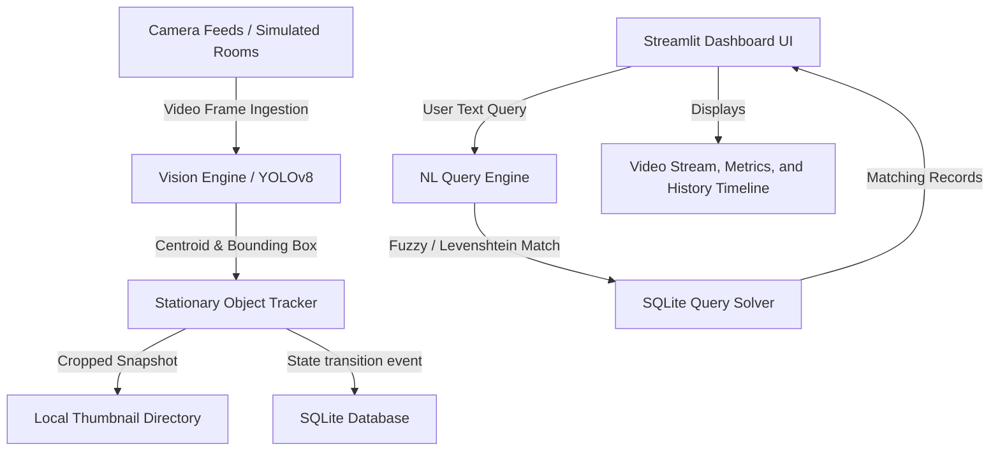

# 🛡️ Findora AI: Local Spatial Memory & Object Finder

[](https://www.python.org/)
[](https://streamlit.io/)
[](https://opencv.org/)
[](https://www.sqlite.org/)
[](LICENSE)

Findora AI is a fully functional, local, hardware-free prototype of a **spatial memory and edge tracking system**. It is designed for private, local-first environments where household items are tracked using on-device computer vision. It detects when items become stationary or are displaced, logs their state transitions in a local SQLite database, and supports searching for them via a natural language query interface.

---

## 🏗️ System Architecture



---

## 🌟 Key Features

1. **📹 2D Virtual Room Canvas Rendering & Physics Simulation**
   - High-fidelity visual rooms (Living Room and Bedroom) drawn dynamically in OpenCV.
   - Smooth movement animations and object displacements illustrating physical item state changes.
   - **Cross-Camera Handoff**: Objects (such as a smartphone) disappear from one camera room, get logged as `LOST` (disappeared), and smoothly transition to appear in another room camera.

2. **🧠 Stationary Tracking Engine**
   - Computes centroid trajectories and monitors pixel deviations over time ($N$ pixels over $T$ consecutive seconds).
   - Dynamically renders **tracking trails** behind objects to display motion paths.
   - Automatically crops a targeted `200x200px` thumbnail image upon stationary locking to protect spatial privacy.

3. **🔍 Fuzzy Natural Language Search**
   - Type queries in plain English (e.g. *"Where is my phone?"*, *"Did I leave my book in the Bedroom?"*).
   - Incorporates a local **Levenshtein Distance** string matching algorithm to correct spelling typos (e.g., `"phn"` -> `"phone"`).
   - Provides **Context-Aware Suggestions** for lost/missing items by looking up historical stationary logs (e.g., *"Check near its last known stationary location in the Bedroom"*).

4. **⏳ Chronological Audit Trails**
   - Generates itemized spatial timelines showing when and where items moved.
   - Calculates **stationary stay durations** (e.g. *"Stayed at this spot for 2 hours 15 minutes"*) by comparing subsequent timeline events.

5. **🛡️ 100% Edge Privacy Guard**
   - Zero internet connectivity, cloud accounts, or third-party servers required.
   - Bounding boxes are processed on-device in volatile RAM; raw video feeds are never saved to disk.
   - Clean UI control panel allows permanently purging the SQLite database and all cached thumbnail files with one click.

---

## 📂 Project Structure

```text
├── app.py                     # Streamlit application layout (Tabs, metrics, and logs)
├── config.py                  # Core system parameters (Thresholds, target classes, and paths)
├── generate_mock_data.py      # Timeline seeder (creates dummy SQLite logs and thumbnails)
├── requirements.txt           # Python dependency specifications
├── LICENSE                    # MIT License terms
├── README.md                  # Project documentation
├── database/
│   ├── __init__.py
│   ├── db.py                  # SQLite schema definitions & insertion/retrieval functions
│   └── thumbnails/            # Local storage for 200x200px cropped image templates
└── engine/
    ├── __init__.py
    ├── vision.py              # Multi-threaded frame processor & 2D rendering loop
    ├── tracker.py             # Stationary logic algorithms & state machines
    └── query.py               # Fuzzy intent parser & Levenshtein string matchers
```

---

## 🚀 Getting Started

### 1. Installation
Clone the repository and install the dependencies:
```powershell
pip install -r requirements.txt
```
*(Note: If PyTorch or Ultralytics are not installed, the project automatically falls back to its integrated simulated physics/detection engine, offering 100% functional UI capabilities).*

### 2. Populate Mock Timeline
To explore the temporal timeline features immediately, seed the database:
```powershell
python generate_mock_data.py
```

### 3. Run the Application
Launch the Streamlit server locally:
```powershell
streamlit run app.py
```
Open the provided local URL in your web browser (usually `http://localhost:8501`).

---

## 🔄 Simulation Loop Details

When running in **Simulation Mode** (without live webcams or video files), the system cycles through a **60-second animated timeline**:
- **0s to 10s**: Phone sits on the Living Room table (Logs `STATIONARY`).
- **10s to 16s**: Phone slides smoothly to the couch (Logs `MOVED`).
- **16s to 25s**: Phone rests on the Sofa cushion (Logs `STATIONARY`).
- **25s to 30s**: Phone moves off-screen and disappears (Living Room logs `LOST`).
- **29s to 34s**: Phone enters the Bedroom door, moving to the bed (Registered as new track).
- **34s to 42s**: Phone rests on the Bed pillow (Bedroom logs `STATIONARY`).
- **42s to 48s**: Phone moves to the study desk (Logs `MOVED`).
- **48s to 56s**: Phone rests on the study desk (Bedroom logs `STATIONARY`).
- **56s to 60s**: Phone leaves the bedroom frame (Bedroom logs `LOST`).

This loop demonstrates multi-camera hands-off spatial memory logging continuously.
